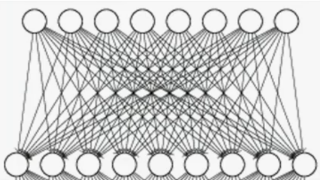
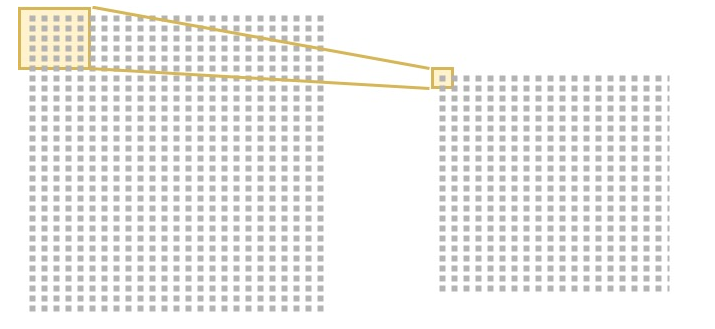

# Dagsorden uge 13
1. Gennemgå 12x mnist digits neural model
2. 

keras
- [interactive tensorflow neural network demo](https://playground.tensorflow.org/#activation=linear&regularization=L1&batchSize=10&dataset=gauss&regDataset=reg-plane&learningRate=0.1&regularizationRate=0.1&noise=0&networkShape=4,2&seed=0.05661&showTestData=false&discretize=false&percTrainData=50&x=true&y=true&xTimesY=false&xSquared=false&ySquared=false&cosX=false&sinX=false&cosY=false&sinY=false&collectStats=false&problem=classification&initZero=false&hideText=false)
- [convolutional network with downsampling layers](https://www.cs.ryerson.ca/~aharley/vis/conv/flat.html)
- Deep learning. Takes a lot of trial and error, to see what works best.
  - lots of different activation functions and optimizers to choose from etc. keep it simple at first.
- sequential model (most common, flows from left to right network layers)
- Dense neural network for eg analysing images where each pixel is represented by an input neuron 
- Alternatives are 
  - convolutional neural network (good for finding edges in images - a window of some pixels are compared over the entire image)
  - and recurrent neural networks) - Feeds the output back into the input of the neurons
```python
from keras.models import Sequential
# model instance
model = Sequence()
# define each layer in the network
from keras.layers import Dense # the simplest layer type
```

### dense layer means a fully interconnected graph
Each node in one layer is fully connected to each node in another layer.
Use this for flexibility when we dont know what is going to happen in the data (no assumptions about the input)
```python
input_layer = Dense(units=512,  # 512 units (output size of nodes) is an arbitrary number (might be ajusted later up or down to see what gives most accuracy)
                activation='sigmoid', # activation is the activation function used to pass dot product of all inputs and weights through. Default activation method is None. None means a simple linear activation which is not what we want since data is not linearly seperable.
                input_shape=(image_size,)) #28x28 for the mnist image size

```
### Convolutional neural network

- filter: how many windows goving over the 2d data
- kernel: how big are the windows width by height of "pixels"
- a set of "pixels" (kernel) is transformed into a single value that represents the data in the kernel. This creates a pattern that is very suited for image recognition.
- keras: layers.Conv2D(64,(3,3),activation='relu')
- activation is the function used on the output after the convolution finishes


## Data wrangling (munging)


